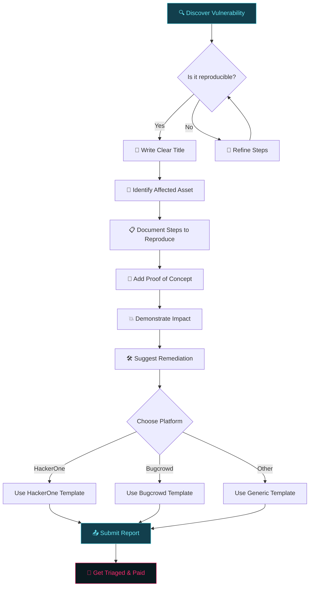
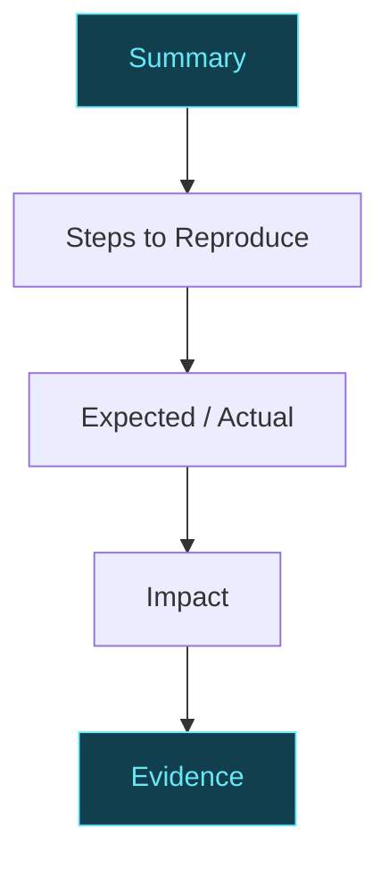
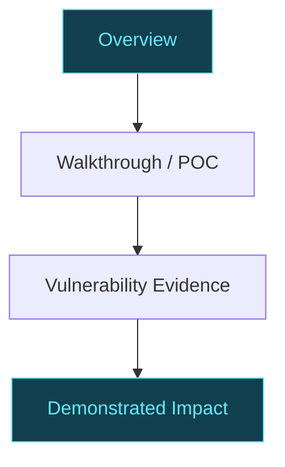
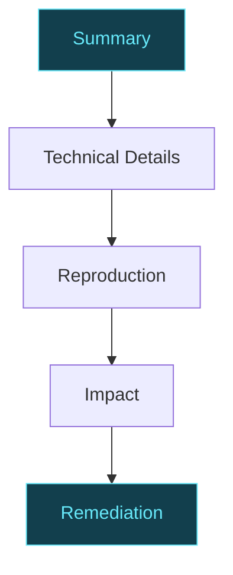

Finding a vulnerability is exciting.

Writing about it is where many researchers suddenly forget how sentences work.

A good bug bounty report is not a novel, a dump of Burp requests, or a declaration that "critical RCE" happened because one parameter looked suspicious.

A professional report has one job:

**Make the security team understand, reproduce, and assess the vulnerability as quickly as possible.**

The exact submission form varies by platform and program, but the fundamentals remain consistent: a clear title, affected target, reproducible steps, proof of concept, demonstrated impact, and enough technical context to validate the finding. HackerOne and Bugcrowd both explicitly emphasize these elements in their current reporting guidance.

## What makes a report professional?

A strong report normally answers five questions:

```text
1. What is the vulnerability?
2. Where does it exist?
3. How can I reproduce it?
4. What can an attacker actually do?
5. What should the program fix?
```

### The Report Writing Flow



The exact fields depend on the platform and the individual program. Some programs add custom fields or their own report templates, so the program policy should always take priority. HackerOne, for example, allows programs to configure custom report templates and additional information fields.

A useful universal structure is:

```text
Title
Summary
Affected Asset
Technical Details
Prerequisites
Steps to Reproduce
Proof of Concept
Expected vs Actual Behavior
Impact
Severity
Remediation
Evidence
```

## Platform-specific report templates

The underlying vulnerability does not change because you submitted it to a different website.

The **format around it does**.

Trying to submit exactly the same giant report everywhere is a good way to make humans regret inventing websites.

### Platform Comparison

| Feature | HackerOne | Bugcrowd | Generic |
|---------|-----------|----------|---------|
| Asset Type Selection | ✅ Required | ✅ Required | ❌ Manual |
| Custom Templates | ✅ Program-defined | ❌ Fixed | ❌ Fixed |
| Severity Field | ⚡ Optional | ⚡ Required | ⚡ Optional |
| Weakness Category | ✅ CVSS-based | ✅ VRT-based | ❌ Free text |
| Attached Media | ✅ Unlimited | ✅ Unlimited | ⚡ Varies |

### HackerOne

HackerOne's current submission flow asks researchers to select an asset type, report template, weakness, and optionally severity, then provide a proof of concept describing the vulnerability, reproduction steps, and attacker impact. Programs can also define additional custom fields.

A practical HackerOne template:

```markdown
## Summary

[Describe the vulnerability and affected functionality in 2–4 sentences.]

## Steps to Reproduce

1. Log in as [User A].
2. Navigate to [URL].
3. Send the following request:

```http
GET /api/orders/1001 HTTP/2
Host: example.com
Authorization: Bearer USER_A_TOKEN
```

4. Change `1001` to `1002`.
5. Replay the request using User A's session.
6. Observe that the response contains User B's order.

## Expected Behavior

[Explain what should happen.]

## Actual Behavior

[Explain what actually happens.]

## Impact

[Explain what an attacker can realistically achieve.]

## Supporting Evidence

[Attach screenshots, video, HTTP requests, or other useful evidence.]

## Remediation

[Describe the appropriate server-side security control.]
```

HackerOne's own quality guidance emphasizes clear numbered reproduction steps, relevant URLs and parameters, impact assessment, and supporting evidence.

### Bugcrowd

Bugcrowd currently exposes more explicit fields during submission, including:

```text
Summary Title
Target
Technical Severity
URL / Location
Description
Attachments
```

Its documentation specifically recommends that the description cover an overview, walkthrough and PoC, vulnerability evidence, and demonstrated impact.

A practical Bugcrowd template:

```markdown
## Overview

[What is the vulnerability?]

## Affected Target

- Target: https://example.com
- Endpoint: GET /api/orders/{id}
- Parameter: `id`
- Authentication: Required

## Vulnerability Details

[Explain the root cause and why the behavior is unauthorized.]

## Walkthrough / Proof of Concept

1. Authenticate as User A.
2. Request `/api/orders/1001`.
3. Change the object ID to `1002`.
4. Replay the request.
5. Observe User B's order in the response.

### Request

```http
GET /api/orders/1002 HTTP/2
Host: example.com
Authorization: Bearer REDACTED
```

### Response

```json
{
  "id": 1002,
  "owner": "user_b",
  "total": 249.99
}
```

## Vulnerability Evidence

[Add screenshots, video, HTTP request/response, or other supporting evidence.]

## Demonstrated Impact

[Describe the exact data or functionality an attacker can access.]

## Remediation

[Describe the server-side authorization control that should be enforced.]
```

Bugcrowd also uses its Vulnerability Rating Taxonomy as a baseline classification, while noting that the final severity depends on the demonstrated impact.

## Generic template for other platforms

Not every platform uses the same field names.

For platforms with simpler submission forms, a compact Markdown report works well:

```markdown
# [Vulnerability] in [Endpoint] allows [Impact]

## Summary

[Short explanation of the vulnerability.]

## Affected Asset

[Domain, endpoint, application, feature, or parameter.]

## Prerequisites

- [Required account/role]
- [Required state]
- [Any other prerequisite]

## Steps to Reproduce

1. [Step]
2. [Step]
3. [Step]
4. [Step]

## Proof of Concept

```http
[Relevant request]
```

## Expected Behavior

[What should happen.]

## Actual Behavior

[What happens instead.]

## Impact

[Concrete attacker capability and affected users/data.]

## Remediation

[Reasonable server-side mitigation.]

## Evidence

[Screenshots, video, logs, request/response pairs.]
```

The universal principles are consistent with current guidance across major platforms: reproduce the issue clearly, demonstrate impact, and provide useful evidence.

## The same vulnerability on different platforms

Suppose you discover:

```text
BOLA in GET /api/orders/{id}
```

### HackerOne

Keep the report focused:



### Bugcrowd

Structure the description around its explicit concepts:



### Other platforms

Use:



The **evidence remains identical**.

Only the packaging changes.

## Don't blindly copy the template

The platform is not necessarily the most important source of formatting instructions.

The **individual bug bounty program** is.

A program may require:

```text
Specific severity taxonomy
Specific reproduction format
Special headers
Separate impact fields
Special disclosure rules
Video evidence
Test account details
Custom fields
```

HackerOne explicitly supports program-specific custom fields, while Bugcrowd's submission flow also varies according to the program brief and target configuration.

So the correct priority is:

```text
Program Policy
      ↓
Platform Requirements
      ↓
Your Standard Report Template
```

Not:

```text
Your favorite template
      ↓
Ignore program instructions
      ↓
Hope for bounty
```

The second workflow has surprisingly poor conversion rates.

## A professional title across platforms

The title should communicate:

```text
Vulnerability + Location + Impact
```

### Weak

```text
IDOR found
```

### Better

```text
BOLA in /api/orders/{id} allows cross-account order access
```

### Stronger

```text
BOLA in /api/orders/{id} exposes customer order data to any authenticated user
```

HackerOne specifically recommends descriptive titles that quickly communicate the vulnerability and its impact, while Bugcrowd requires the title to provide a concise overview of the bug, location, and impact.

## Severity should not be identical across every platform

Do not assume:

```text
HackerOne = High
Bugcrowd = High
Everyone else = High
```

Severity systems and program-specific expectations differ.

HackerOne currently allows researchers to select None, Low, Medium, High, or Critical and optionally use CVSS.

Bugcrowd uses VRT as its baseline taxonomy, but its documentation explicitly notes that the baseline rating does not guarantee the final severity after impact is considered.

A better approach is:

```text
Technical vulnerability
        ↓
Demonstrated impact
        ↓
Program's severity guidance
        ↓
Suggested severity
```

Do not reverse the process because you would like a larger number.

## One report, one root cause

Suppose you discover:

```text
/api/orders/1001
/api/orders/1002
/api/orders/1003
/api/orders/1004
```

all expose other users' orders because the same authorization check is missing.

Do not automatically submit four reports.

First determine whether they share the same root cause.

A better report may say:

```text
The same BOLA vulnerability affects the following endpoints:
- GET /api/orders/{id}
- PATCH /api/orders/{id}
- DELETE /api/orders/{id}
```

Then clearly explain whether these are separate impacts of the same root cause or genuinely independent vulnerabilities.

## A final platform-adaptation workflow

Before submitting, use this process:

```text
1. Read the program policy
2. Confirm the asset is in scope
3. Identify the platform's required fields
4. Start from your standard report template
5. Adapt it to the platform's fields
6. Add program-specific information
7. Verify reproduction from a clean session
8. Redact secrets and personal data
9. Attach useful evidence
10. Check severity against the program's guidance
11. Review the report once as a stranger
12. Submit
```

HackerOne currently warns that reports cannot be edited after submission, and Bugcrowd likewise notes that submitted reports cannot be edited, so the final review is not just ceremonial paperwork.

## The universal report template

Regardless of platform, keep one master template in your notes:

```markdown
# [Vulnerability] in [Location] allows [Impact]

## Summary

[What is broken and why it matters.]

## Affected Asset

[Target / URL / endpoint / parameter.]

## Technical Details

[Root cause and relevant technical context.]

## Prerequisites

[Accounts, roles, configuration, or other requirements.]

## Steps to Reproduce

1. [Step]
2. [Step]
3. [Step]
4. [Step]

## Proof of Concept

[HTTP request, code, screenshot, or video.]

## Expected Behavior

[What the application should do.]

## Actual Behavior

[What the application actually does.]

## Impact

[Concrete attacker capabilities, affected users, data, or functionality.]

## Severity

[Suggested severity with a short technical justification.]

## Remediation

[Reasonable server-side mitigation.]

## Evidence

[Additional screenshots, videos, logs, or request/response pairs.]
```

Then transform that master version into the format expected by each platform.

That gives you consistency without producing identical reports blindly.

## The real goal

A bug bounty report should make the triager's job boring.

They should be able to:

```text
Read the title
    ↓
Understand the vulnerability
    ↓
Follow the steps
    ↓
See the PoC
    ↓
Verify the impact
    ↓
Assign severity
    ↓
Send it to engineering
```

That is what a professional report looks like.

The platform may change. The form may change. The number of fields may change.

The underlying standard does not:

**Clear. Reproducible. Evidence-based. Impact-focused.**

Everything else is formatting, and humanity has somehow managed to build entire companies around formatting.